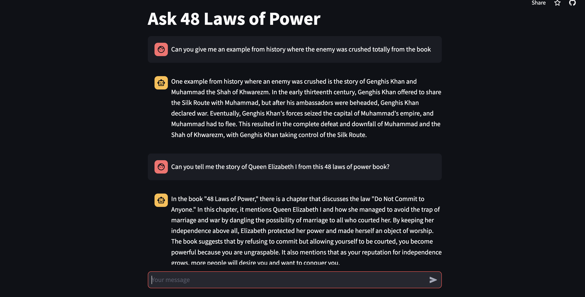

# Ask 48 Laws of Power

This repository contain the code for the deployed RAG(Retrieval Augmented Generation) based application where you can ask question about anything based on the book named "48 Laws of Power" by Robert Greene and an LLM will answer your questions on the basis of the book.

Go check out by yourself - [Link](https://ask48lawsofpower-hovzy6rtiugewdn9a2kbht.streamlit.app/)

## Snapshot 


## Recreation of the app
To recreate this app on your local machine-
1. clone this repository in the suitable location you prefer 
2. You need to create _.streamlit_ folder and in that folder there should be _config.toml_ file. _config.toml_ file should contain the openai api key of yours as below - 


```bash
OPENAI_API_KEY="<your_api_key>"
```
3. create a python virtual environment by executing the following commands, install the required libraries. Voila you are ready to run the app. You need to execute the following commands one after another- 
```bash
python -m venv .
pip install -r requirements.txt 
source ./bin/activate
streamlit run streamlit_app.py
```

If you like the app, don't forget to star it. 